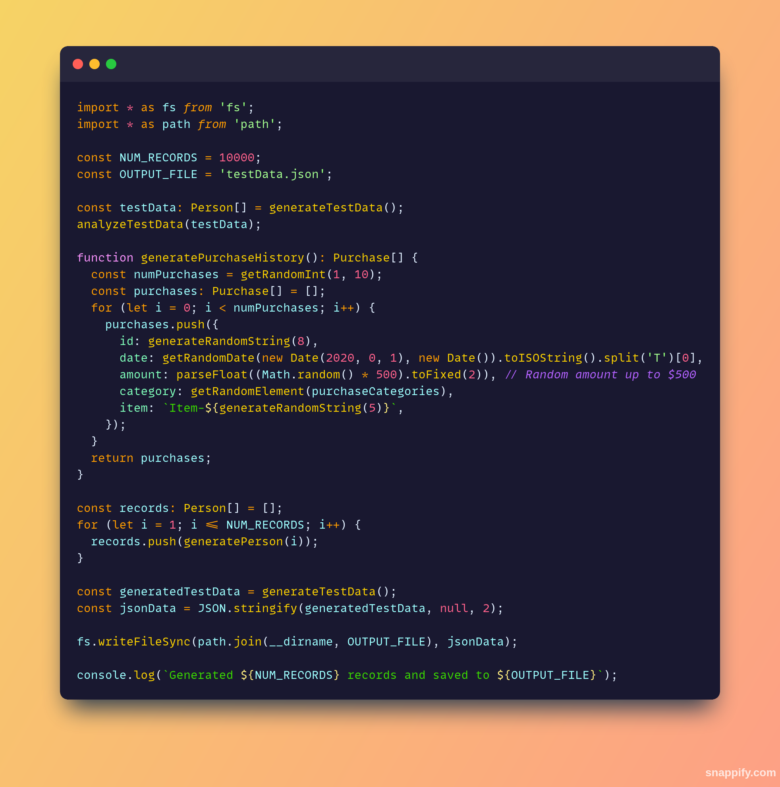
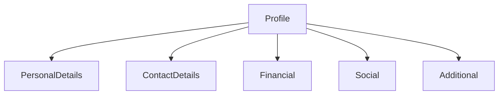

<h1 align="center">
  
</h1>

<p align="center">
  
  
</p>

Welcome to the Fake Identity Generator project! This TypeScript tool helps you generate large-scale synthetic data for testing purposes. With it, you can create up to 100,000 user profiles, each containing personal, contact, socioeconomic, and social data. 📊


## </>Codebase



## 🛠 Features
✨ **High Volume Data**: Generate up to 100,000 profiles
<br>
📇 **Detailed Profiles**

Every profile includes:

- 👤 Basic info (name, age, etc.)
- 📍 Contact (address, phone)
- 💵 Financial details (income, credit score)
- 🌐 Social (interests, social links)


## 📋 Data Structure
Each profile includes:

- **ID**: 🆔 Unique identifier
- **Personal Details**: 👤 Name, 📧 Email, 🎂 Age, 📅 Birth Date
- **Addres**s: 🏠 Street, 🌆 City, 🗺️ State, 🏷️ Zip Code, 🌍 Country
- **Contact**: 📞 Phone Number, 💼 Occupation
- **Financial**: 💵 Income, 📈 Credit Score, 🛍️ Purchase History
- **Social**: 💍 Marital Status, 🎓 Education, 🌐 Social Media Links
- **Additional**: 🎨 Hobbies, 🌟 Interests, 👶 Children Status

## 🚀 Getting Started

- Clone this repository.
- Install dependencies (requires Node.js and TypeScript).
- **Run:**

```bash
ts-node index.ts
```
✨ The generated dataset will be saved to `testData.json` in the project directory.

> [!NOTE]
> For a detailed explanation of how the Fake Identity Generator works, including its data structures and generation logic, please see our comprehensive tutorial: **[Read the Full Tutorial](./docs/tutorial.md)**

---

## Sample Code Snippet

```typescript

import * as fs from "fs";
import * as path from "path";

const NUM_RECORDS = 100000;
const OUTPUT_FILE = "testData.json";

function generatePerson(id: number): Person {
  // Random data generation here...
}

function generateDataset() {
  const data = [];
  for (let i = 0; i < NUM_RECORDS; i++) {
    data.push(generatePerson(i + 1));
  }
  fs.writeFileSync(OUTPUT_FILE, JSON.stringify(data, null, 2));
}

generateDataset();
```

## 📊 Data Summary
Below is a sample data distribution for the generated dataset:



This graph shows how each profile’s data is organized by categories!

## ⚙️ Customization

- Change `NUM_RECORDS` to adjust profile count.
- Edit arrays like `firstNames`, `occupations` for custom values.
- Modify data fields and randomization for specific needs.

## 📅 Future Improvements

- 📝 Additional fields
- 💡 More realistic data (e.g., address formats)
- 📊 Expanded purchaseHistory

## 📜 License
This project is licensed under the MIT License.
<br>

<p align="center">
  
</p>
