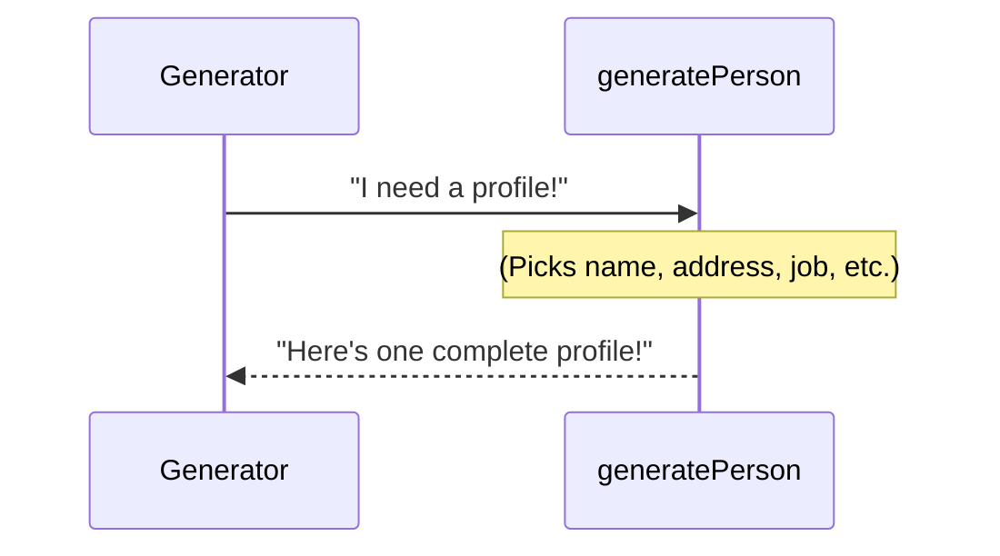

# Chapter 1: Person Profile

Welcome to the tutorial for the Fake Identity Generator! In this first chapter, we'll explore the core idea behind the whole project: the **Person Profile**.

### What is a Person Profile?

Imagine you're creating an app and you need to test it with lots of different users. You could manually make up names, addresses, and job titles, but that would take forever! This is where the Fake Identity Generator comes in.

Its main job is to create **fake users**, and each fake user is represented by a **Person Profile**. Think of a Person Profile like a digital ID card or a detailed contact entry for one imaginary person. It holds *all* the generated information about them in one place.

This "Person Profile" is the fundamental building block of the data created by this tool. When the generator runs, it doesn't just make a list of names and a separate list of addresses; it creates a complete profile for *each* fake person.

### What's Inside a Person Profile?

A Person Profile contains various pieces of information, like:

*   A unique ID number (so you can tell them apart)
*   Their name (first and last)
*   Their age and birth date
*   Their contact information (address, phone number, email)
*   Information about their job and money (occupation, income, credit score, purchase history)
*   Details about their life (marital status, education, interests, social media links)

You can see this structure outlined in the project's README file:

```markdown
## 📋 Data Structure
Each profile includes:

- **ID**: 🆔 Unique identifier
- **Personal Details**: 👤 Name, 📧 Email, 🎂 Age, 📅 Birth Date
- **Addres**s: 🏠 Street, 🌆 City, 🗺️ State, 🏷️ Zip Code, 🌍 Country
- **Contact**: 📞 Phone Number, 💼 Occupation
- **Financial**: 💵 Income, 📈 Credit Score, 🛍️ Purchase History
- **Social**: 💍 Marital Status, 🎓 Education, 🌐 Social Media Links
- **Additional**: 🎨 Hobbies, 🌟 Interests, 👶 Children Status
```

This list shows the different *categories* of information that make up a complete profile. Later chapters will dive into each of these categories in more detail.

### How the Generator Creates a Profile (The Big Picture)

The main goal is to create many Person Profiles. The project has a function whose specific job is to create *one* profile at a time. Let's look at a simplified version of that function, found in `src/generateTestData.ts`:

```typescript
function generatePerson(id: number): Person {
  // ... code to create a fake person's details ...

  return {
    id,
    firstName: "...", // Generated data
    lastName: "...",  // Generated data
    email: "...",     // Generated data
    // ... many other details ...
  };
}
```

This function, `generatePerson`, takes a number (`id`) and, when finished, gives back a `Person` object. This `Person` object *is* our "Person Profile". It's like filling out that digital ID card step by step.

### Under the Hood: Building a Profile

When the generator needs a new fake person, it calls the `generatePerson` function. What happens inside that function?

1.  It starts with an ID.
2.  It then figures out a random first name from a list.
3.  It picks a random last name from another list.
4.  It calculates things like age and birth date.
5.  It generates an address, a phone number, an email, and so on, often picking from predefined lists or using simple rules.
6.  Finally, it collects all these pieces of information and packages them together into a single `Person` object.

Here’s a super simple look at this process:



This diagram shows that the Generator asks for a profile, the `generatePerson` function does the work of gathering all the details, and then returns the finished profile back to the Generator.

In the code, the `Person` type definition tells us exactly what properties (like `firstName`, `address`, `income`) are expected to be part of every `Person Profile` object created by the `generatePerson` function:

```typescript
type Person = {
  id: number;
  firstName: string;
  lastName: string;
  email: string;
  age: number;
  birthDate: string;
  address: Address; // This is another structure for address details
  phoneNumber: string;
  occupation: string;
  income: number;
  creditScore: number;
  hasChildren: boolean;
  education: string;
  maritalStatus: string;
  interests: string[];
  socialMedia: SocialMedia; // Another structure for social links
  purchaseHistory: Purchase[]; // And another for purchase history
};

// Note: Address, SocialMedia, Purchase are also defined as types
// showing their specific structures.
```

This `type Person = { ... }` block is essentially the blueprint for our "Person Profile" digital card. It lists all the fields and what kind of data they should hold (like `string` for text, `number` for numbers, or even other structured types like `Address`).

### Conclusion

In this chapter, we learned that the **Person Profile** is the main piece of data created by the Fake Identity Generator. It's like a complete digital card for one fake person, containing all their generated information. The tool uses a function (`generatePerson`) to build each of these profiles one by one, gathering data for all the different fields defined in the `Person` blueprint.

In the next chapter, we'll start digging into the specific details *within* a profile, focusing on the most basic information: the **[Personal Details](02_personal_details_.md)**.

---