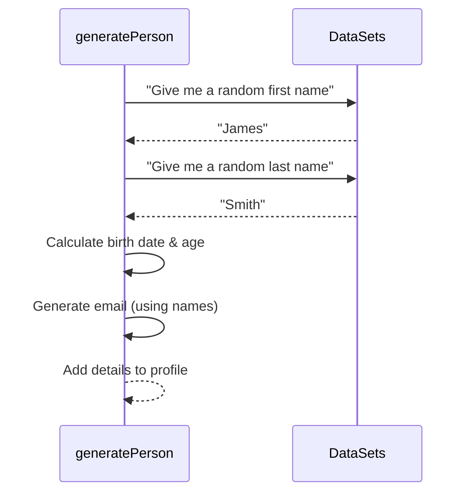

# Chapter 2: Personal Details

Welcome back! In [Chapter 1](01_person_profile_.md), we learned that the core output of the Fake Identity Generator is the **Person Profile**, a complete digital card for an imaginary person. Think of it as a collection of different kinds of information.

Now, let's start opening up that profile card and look at the very first things you'd see: the **Personal Details**.

### What are Personal Details?

Imagine you're filling out a very basic form online – the kind that just asks for your name, email, and maybe your birth date. These fundamental pieces of information are what we call "Personal Details" in the context of our generator.

They are the most basic identifying facts about a person. They are like the front of a simple ID card or the first few lines of a contact entry.

In the `Fake-Identity-Generator` project, the Personal Details within each [Person Profile](01_person_profile_.md) include:

*   **Name:** Both the first name and the last name.
*   **Email:** A generated email address.
*   **Age:** How old the person is.
*   **Birth Date:** The specific date they were born.

These are the essential building blocks that help distinguish one fake person from another at a glance.

### Where Do You See Personal Details?

When the generator runs, it creates a big JSON file (`testData.json`) containing a list of [Person Profile](01_person_profile_.md) objects. Each object in that list represents one fake person, and the Personal Details are the first few pieces of information listed for that person.

Let's look at a simplified example of what this might look like in the output file for one person:

```json
[
  {
    "id": 1,
    "firstName": "James",
    "lastName": "Smith",
    "email": "james.smith@example.com",
    "age": 35,
    "birthDate": "1989-07-15",
    "address": {
      // ... address details here ...
    },
    // ... other details follow ...
  }
  // ... potentially other person objects ...
]
```

In this snippet from the output JSON:

*   `"id": 1` is the unique ID (as discussed in Chapter 1).
*   `"firstName": "James"` and `"lastName": "Smith"` provide the person's name.
*   `"email": "james.smith@example.com"` gives their generated email address.
*   `"age": 35` tells us their age.
*   `"birthDate": "1989-07-15"` gives their specific birth date.

These are the core Personal Details generated for this specific profile.

### How the Generator Creates Personal Details

As we saw in [Chapter 1](01_person_profile_.md), the magic happens inside the `generatePerson` function. This function is responsible for figuring out *all* the details for one profile, including the personal ones.

Here's a simplified look at the process for just the personal details:



The `generatePerson` function asks for pieces of information (like names) from the available lists (Data Sets), calculates others (like age based on birth date), combines the names to make an email, and then puts all these pieces together into the profile object.

### Looking at the Code

Let's peek at the `src/generateTestData.ts` file to see where these details are defined and generated.

First, recall the blueprint for a `Person` from [Chapter 1](01_person_profile_.md):

```typescript
// src/generateTestData.ts
type Person = {
  id: number;
  firstName: string; // <-- Personal Detail
  lastName: string;  // <-- Personal Detail
  email: string;     // <-- Personal Detail
  age: number;       // <-- Personal Detail
  birthDate: string; // <-- Personal Detail
  // ... other details ...
};
// ... rest of the file ...
```

This `type Person` block tells us exactly what fields are expected for Personal Details: `firstName`, `lastName`, `email`, `age`, and `birthDate`. It also specifies the type of data each field holds (like `string` for text or `number`).

Now, let's look at the `generatePerson` function itself and focus *only* on the lines that create these personal details:

```typescript
// src/generateTestData.ts

// ... (other helper functions and data sets above) ...

function generatePerson(id: number): Person {
  // 1. Pick random names from lists (Data Sets)
  const firstName = getRandomElement(firstNames); // firstNames is a list like ["James", "Mary", ...]
  const lastName = getRandomElement(lastNames);   // lastNames is a list like ["Smith", "Johnson", ...]

  // 2. Calculate birth date and age
  const birthDate = getRandomDate(new Date(1950, 0, 1), new Date(2003, 11, 31)); // Pick random date
  const age = new Date().getFullYear() - birthDate.getFullYear();             // Calculate age

  // 3. Generate email using names
  const email = `${firstName.toLowerCase()}.${lastName.toLowerCase()}@example.com`; // Simple format

  // 4. Create and return the Person object with these details
  return {
    id,
    firstName, // Assign the generated first name
    lastName,  // Assign the generated last name
    email,     // Assign the generated email
    age,       // Assign the calculated age
    birthDate: birthDate.toISOString().split("T")[0], // Assign formatted birth date
    address: generateAddress(), // <-- Details from the next chapter!
    // ... assign other generated details ...
  };
}

// ... (other functions below) ...
```

This snippet shows the key steps:

*   `getRandomElement(firstNames)` and `getRandomElement(lastNames)` pick names randomly from the predefined lists (`firstNames` and `lastNames` arrays in the same file, which you can see by scrolling up in `src/generateTestData.ts`).
*   `getRandomDate(...)` picks a random birth date within a certain range (here, between 1950 and 2003).
*   The `age` is calculated by subtracting the birth year from the current year.
*   A simple email is created by combining the lowercased first and last names with `@example.com`.
*   Finally, these generated values (`firstName`, `lastName`, `email`, `age`, `birthDate`) are used when creating the `Person` object that gets returned.

This section of the code is solely responsible for creating the basic Personal Details for each fake identity.

### Conclusion

In this chapter, we focused on the **Personal Details** within a [Person Profile](01_person_profile_.md). We learned that these are the core, fundamental pieces of identification like name, email, age, and birth date. We saw where they appear in the output data and looked at the basic process and code within the `generatePerson` function that creates them by picking from lists and performing simple calculations.

These details form the basic identity layer of our fake person. In the next chapter, we'll build upon this by adding information about where the person lives and how you might get in touch with them.

Ready to add more layers? Let's move on to **[Contact & Location](03_contact___location_.md)**.

---
