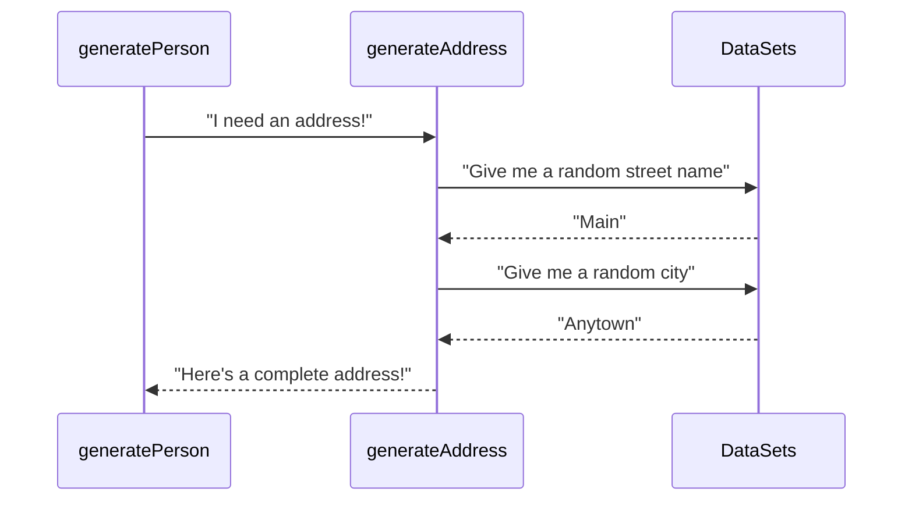

# Chapter 3: Contact & Location

Welcome back, future data generator! In our journey through the `Fake-Identity-Generator` project, we first learned about the main output, the **[Person Profile](01_person_profile_.md)**, in [Chapter 1](01_person_profile_.md). Then, in [Chapter 2](02_personal_details_.md), we opened that profile card and looked at the most basic information: the **Personal Details** like name, age, and email.

Now, let's add another layer to our fake person's identity: **Contact & Location**.

### What is Contact & Location?

Think about how you interact with people or businesses in the real world. You need to know where they are or how to reach them. The **Contact & Location** part of a fake profile provides exactly this information for our imaginary person.

This abstraction covers two main things:

1.  **Where they live:** A physical address.
2.  **How to call them:** A phone number.

Why is this important for fake data? If you're testing an e-commerce website, you need fake addresses for shipping. If you're testing a user registration system, you might need a fake phone number for account verification. Contact and location details make the fake identity feel more "real" and useful for these kinds of tests.

It provides the practical, real-world points of contact and residency for the fake identity.

### Where Do You See Contact & Location Details?

Just like Personal Details, the Contact & Location information is part of the overall [Person Profile](01_person_profile_.md) object generated in the `testData.json` file.

Looking at a simplified example of the JSON output for one person, you'll see these details included:

```json
[
  {
    "id": 1,
    "firstName": "James",
    "lastName": "Smith",
    // ... other personal details ...
    "address": { // <-- This is the address structure
      "street": "123 Main St",
      "city": "Anytown",
      "state": "CA",
      "zipCode": "90210",
      "country": "United States"
    },
    "phoneNumber": "(555) 123-4567", // <-- This is the phone number
    // ... other details follow ...
  }
  // ... potentially other person objects ...
]
```

In this snippet:

*   `"address"` is a dedicated block (or "object" in programming terms) that holds all the parts of the physical location: `"street"`, `"city"`, `"state"`, `"zipCode"`, and `"country"`.
*   `"phoneNumber"` is a simple text field storing the generated phone number.

These fields give the fake person a place to "live" and a way to be "called."

### How the Generator Creates Contact & Location Details

As we've seen, the central `generatePerson` function in `src/generateTestData.ts` is responsible for creating all the pieces of a [Person Profile](01_person_profile_.md). It does this by calling other smaller functions or picking from lists.

Let's look at how it handles the address and phone number.

#### Generating the Address

The address is slightly more complex because it has multiple parts (street, city, state, etc.). The generator handles this by having a specific function just for creating addresses, called `generateAddress()`.

Here's a simple flow for generating the address:



The `generatePerson` function asks `generateAddress` for a complete address. The `generateAddress` function then goes to the `DataSets` (which are just lists of names, cities, etc., defined earlier in the file) to pick random values for each part of the address. Finally, it packages these parts together and gives the complete address back to `generatePerson`.

Let's look at the `generateAddress` function code in `src/generateTestData.ts`:

```typescript
// src/generateTestData.ts

// ... (Data sets like streetNames, cities, states, countries are defined above) ...
// ... (Helper function getRandomElement is defined above) ...
// ... (Helper function getRandomInt is defined above) ...

function generateAddress(): Address {
  return {
    street: `${getRandomInt(1, 9999)} ${getRandomElement(streetNames)} St`, // Combines number and random street name
    city: getRandomElement(cities),     // Picks random city from list
    state: getRandomElement(states),   // Picks random state from list
    zipCode: getRandomInt(10000, 99999).toString().padStart(5, "0"), // Generates random 5-digit number
    country: getRandomElement(countries), // Picks random country from list
  };
}

// ... (Other functions below) ...
```

This small function does the work:

*   It uses `getRandomInt` to get a random number (for the street number) and `getRandomElement` to pick a random street name from the `streetNames` list. It combines them into a simple street format.
*   It picks a random `city` from the `cities` list.
*   It picks a random `state` from the `states` list.
*   It generates a random 5-digit number for the `zipCode`.
*   It picks a random `country` from the `countries` list.
*   It returns all these pieces grouped together as an `Address` object.

#### Generating the Phone Number

Generating the phone number is simpler because it's just one field. The generator uses a function `generatePhoneNumber()` for this.

Here's the code for `generatePhoneNumber` in `src/generateTestData.ts`:

```typescript
// src/generateTestData.ts

// ... (Helper function getRandomInt is defined above) ...

function generatePhoneNumber(): string {
  // Generates a number in the format (XXX) XXX-XXXX
  return `(${getRandomInt(100, 999)}) ${getRandomInt(100, 999)}-${getRandomInt(
    1000,
    9999
  )}`;
}

// ... (Other functions below) ...
```

This function just uses `getRandomInt` three times to generate three sets of random numbers (3 digits, 3 digits, 4 digits) and formats them into a standard US phone number format `(XXX) XXX-XXXX`. It then returns this generated string.

#### Putting It Together in `generatePerson`

Finally, the `generatePerson` function (which we saw in [Chapter 1](01_person_profile_.md) and [Chapter 2](02_personal_details_.md)) calls these two functions and includes their results when building the final `Person` object:

```typescript
// src/generateTestData.ts

// ... (generateAddress and generatePhoneNumber functions are defined above) ...

function generatePerson(id: number): Person {
  // ... generate firstName, lastName, email, age, birthDate ...

  return {
    id,
    // ... assign generated personal details ...
    address: generateAddress(),     // <-- Calls generateAddress() and assigns the result
    phoneNumber: generatePhoneNumber(), // <-- Calls generatePhoneNumber() and assigns the result
    // ... assign other generated details ...
  };
}

// ... (rest of the file) ...
```

The lines `address: generateAddress()` and `phoneNumber: generatePhoneNumber()` are where the magic happens for this chapter's concept. They call the helper functions to get the generated data and then store that data in the correct places (`address` and `phoneNumber` fields) within the `Person` object being created.

### Conclusion

In this chapter, we added the **Contact & Location** layer to our fake identity. We learned that this includes a physical address (broken down into street, city, state, zip code, country) and a phone number. We saw how these details appear in the output JSON and explored the underlying process and code in `src/generateTestData.ts` where the `generateAddress` and `generatePhoneNumber` functions create these details, often by picking random elements from predefined lists.

You now understand how the generator gives each fake person a place to "live" and a way to be "contacted." Building on this foundation, the next layer of information helps define the fake person's life circumstances.

Ready to explore their job and money? Let's move on to **[Socioeconomic/Financial Data](04_socioeconomic_financial_data_.md)**.

---