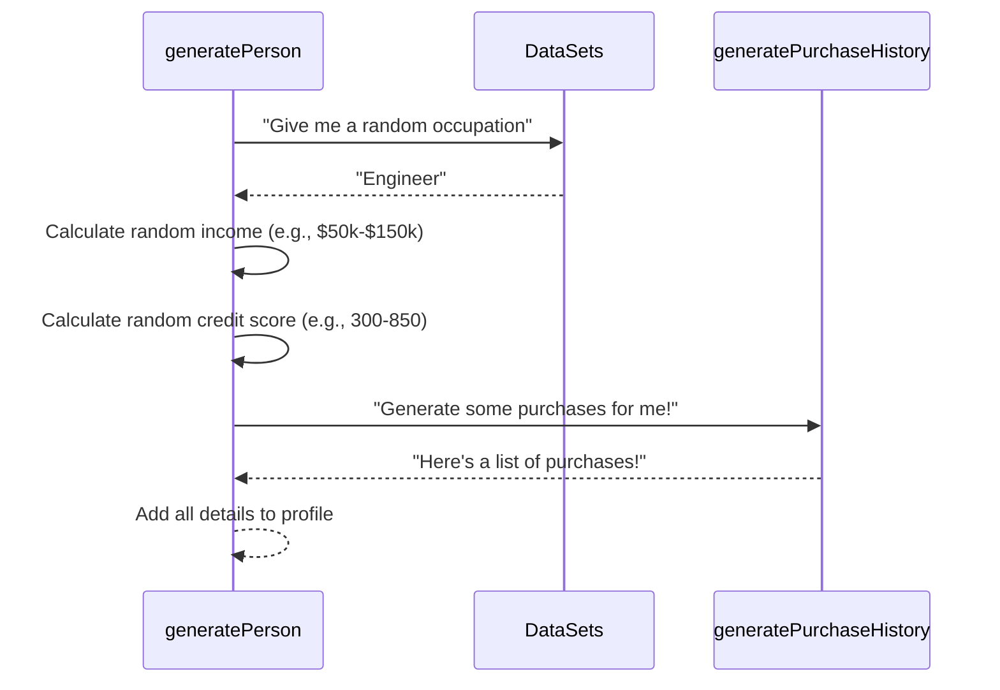

# Chapter 4: Socioeconomic/Financial Data

Welcome back to the Fake Identity Generator tutorial! So far, we've built the foundation of our fake identities. In [Chapter 1](01_person_profile_.md), we understood the core idea of the **Person Profile** as a complete digital card. In [Chapter 2](02_personal_details_.md), we looked at the basic **Personal Details** like name and age. And in [Chapter 3](03_contact___location_.md), we gave our fake people a place to live and a way to be contacted with **Contact & Location** information.

Now, let's add another layer of realism and usefulness by exploring **Socioeconomic/Financial Data**.

### What is Socioeconomic/Financial Data?

This part of the profile is all about the imaginary person's job and money situation. In the real world, this information is crucial for many things, like applying for a loan, understanding a customer's spending habits, or even just figuring out someone's profession.

For fake identities, this type of data is super valuable if you're testing applications or systems that deal with professional roles, income levels, credit checks, or transaction histories. Instead of using real sensitive data, you can use fake data that *looks* real enough for testing.

In the `Fake-Identity-Generator`, the Socioeconomic/Financial Data includes:

*   **Occupation:** Their job title (like 'Engineer' or 'Teacher').
*   **Income:** How much money they supposedly earn.
*   **Credit Score:** A number representing their financial trustworthiness (though this is randomly generated and not based on realistic factors here).
*   **Purchase History:** A list of past shopping transactions.

Adding these details helps create a more complete and believable fake person for various testing scenarios.

### Where Do You See Socioeconomic/Financial Details?

Like all the other pieces of information, the Socioeconomic/Financial Data is included directly within each [Person Profile](01_person_profile_.md) object in the `testData.json` output file.

Let's look at a simplified example of one person's profile output, focusing on these new fields:

```json
[
  {
    "id": 1,
    // ... personal details ...
    // ... contact and location details ...
    "occupation": "Programmer",     // <-- Occupation
    "income": 85000,              // <-- Income level
    "creditScore": 720,           // <-- Credit score
    "purchaseHistory": [          // <-- Purchase history (a list of purchases)
      {
        "id": "abc123xyz",
        "date": "2023-10-26",
        "amount": 45.99,
        "category": "Electronics",
        "item": "Item-abCde"
      },
      {
        "id": "def456uvw",
        "date": "2023-11-10",
        "amount": 120.50,
        "category": "Clothing",
        "item": "Item-fGhIj"
      }
      // ... more purchase objects ...
    ],
    // ... other details follow ...
  }
  // ... potentially other person objects ...
]
```

In this snippet:

*   `"occupation"` is a text field storing a job title.
*   `"income"` is a number representing an annual income.
*   `"creditScore"` is a number simulating a credit score.
*   `"purchaseHistory"` is an **array** (or list) of objects. Each object within this array represents a single `"Purchase"` and has its own details like `"id"`, `"date"`, `"amount"`, `"category"`, and `"item"`.

These fields add the "money and work" dimension to our fake identity.

### How the Generator Creates Socioeconomic/Financial Details

The core function that builds a complete profile is still `generatePerson` in `src/generateTestData.ts`. This function gathers or calculates all the different pieces of information needed for a [Person Profile](01_person_profile_.md), including the socioeconomic and financial ones.

Here's a simple look at the process within `generatePerson` for these specific details:



The `generatePerson` function gets the occupation from a list (`DataSets`). It then calculates random numbers for income and credit score within predefined ranges. For the purchase history, which is a list of items, it asks a dedicated function (`generatePurchaseHistory`) to create that list for it. Finally, it adds all these generated details to the profile object it's building.

### Looking at the Code

Let's peek into `src/generateTestData.ts` to see how these details are generated.

First, let's refresh our memory of the `Person` type definition, which is the blueprint for our profile:

```typescript
// src/generateTestData.ts
type Person = {
  id: number;
  // ... personal details ...
  // ... contact & location details ...
  occupation: string;    // <-- Socioeconomic/Financial
  income: number;      // <-- Socioeconomic/Financial
  creditScore: number; // <-- Socioeconomic/Financial
  purchaseHistory: Purchase[]; // <-- Socioeconomic/Financial (list of Purchases)
  // ... social & additional details ...
};

// Definition for the Purchase type is also needed:
type Purchase = { // <-- Defines the structure of *one* item in the purchase history list
  id: string;
  date: string;
  amount: number;
  category: string;
  item: string;
};

// ... rest of the file ...
```

This shows us the exact fields for this category: `occupation`, `income`, `creditScore`, and `purchaseHistory`. It also tells us that `purchaseHistory` is a list (`[]`) where each item in the list must match the `Purchase` type structure.

Now, let's look at the `generatePerson` function again, focusing on the lines that create these specific fields:

```typescript
// src/generateTestData.ts

// ... (other helper functions and data sets above, including occupations, purchaseCategories) ...
// ... (generateAddress, generatePhoneNumber functions) ...
// ... (generateInterests, generateSocialMedia functions) ...
// ... (Helper functions like getRandomElement, getRandomInt, getRandomDate, generateRandomString) ...

function generatePerson(id: number): Person {
  // ... generate personal details ...
  // ... generate address and phone number ...

  // Generate Socioeconomic/Financial Data:
  const occupation = getRandomElement(occupations); // Pick random job from list
  const income = getRandomInt(20000, 200000);       // Random number between 20k and 200k
  const creditScore = getRandomInt(300, 850);     // Random number between 300 and 850
  const purchaseHistory = generatePurchaseHistory(); // Call function to generate history list

  // Create and return the Person object with all details
  return {
    id,
    // ... assign generated personal details ...
    // ... assign generated contact & location details ...
    occupation,    // Assign the generated occupation
    income,      // Assign the generated income
    creditScore, // Assign the generated credit score
    purchaseHistory, // Assign the generated list of purchases
    // ... assign other generated details ...
  };
}

// ... (Other functions below) ...
```

This part of the `generatePerson` function does the following:

*   `getRandomElement(occupations)`: It picks a random job title from the `occupations` list defined earlier in the file.
*   `getRandomInt(20000, 200000)`: It generates a random whole number between 20,000 and 200,000 for the income.
*   `getRandomInt(300, 850)`: It generates a random whole number between 300 and 850 for the credit score. These ranges are just simple examples.
*   `generatePurchaseHistory()`: It calls another specific function, `generatePurchaseHistory`, whose job is solely to create that list of fake purchases.

Let's look at the `generatePurchaseHistory` function:

```typescript
// src/generateTestData.ts

// ... (Helper functions like getRandomInt, getRandomDate, generateRandomString, getRandomElement) ...
// ... (Data sets like purchaseCategories) ...

function generatePurchaseHistory(): Purchase[] {
  const numPurchases = getRandomInt(1, 10); // Decide randomly how many purchases (1 to 10)
  const purchases: Purchase[] = [];         // Start with an empty list for purchases

  for (let i = 0; i < numPurchases; i++) { // Loop however many times we decided (numPurchases)
    purchases.push({ // Add a new Purchase object to the list:
      id: generateRandomString(8), // Generate a random ID string
      date: getRandomDate(new Date(2020, 0, 1), new Date()) // Generate a random date since 2020
        .toISOString()
        .split("T")[0], // Format the date nicely (YYYY-MM-DD)
      amount: parseFloat((Math.random() * 500).toFixed(2)), // Random amount up to $500 with 2 decimal places
      category: getRandomElement(purchaseCategories), // Pick a random category from the list
      item: `Item-${generateRandomString(5)}`, // Generate a generic item name
    });
  }

  return purchases; // Return the list of created purchase objects
}

// ... (rest of the file) ...
```

This function is a great example of how helper functions and loops are used to build more complex data structures like lists:

1.  It first decides randomly how many purchase items this person should have (between 1 and 10).
2.  It creates an empty list called `purchases`.
3.  It then runs a loop that many times. Inside the loop, for *each* purchase:
    *   It creates a new object using the `Purchase` type blueprint.
    *   It fills in the details for that purchase (a random ID, a random date, a random amount, a random category from the `purchaseCategories` list, and a random item name).
    *   It adds this newly created purchase object to the `purchases` list.
4.  After the loop finishes, the function returns the complete `purchases` list back to `generatePerson`.

This process ensures that each fake person gets a list of random purchases tailored just for them.

### Conclusion

In this chapter, we delved into the **Socioeconomic/Financial Data** aspect of the fake identity profile. We learned that this includes details about a person's job, income, credit score, and past purchase history, which are valuable for testing systems dealing with financial or professional information. We saw where these details fit into the output JSON structure and explored the code in `src/generateTestData.ts`, understanding how `generatePerson` uses helper functions like `getRandomElement` and `getRandomInt` for occupation, income, and credit score, and calls a dedicated function, `generatePurchaseHistory`, to create the list of fake transactions.

You now understand how the generator adds economic context to each fake person. We've covered several categories of data within the [Person Profile](01_person_profile_.md). In the next chapter, we'll zoom out slightly and look at the overall **[Generation Logic](05_generation_logic_.md)** – how `generatePerson` puts *all* these different pieces together to create one complete profile.

Ready to see the bigger picture? Let's move on!

---