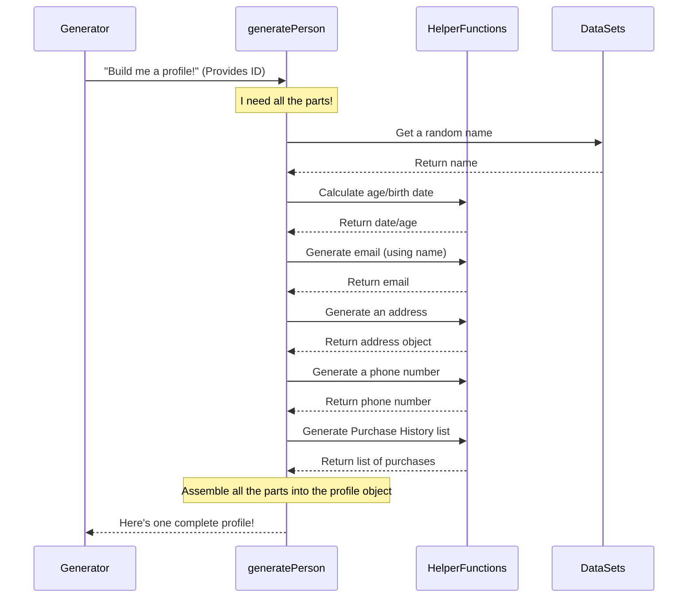

# Chapter 5: Generation Logic

Welcome back! In our previous chapters, we've been looking at the different pieces that make up a fake identity's **[Person Profile](01_person_profile_.md)**. We started with the basic structure in [Chapter 1](01_person_profile_.md), then explored the **[Personal Details](02_personal_details_.md)** ([Chapter 2](02_personal_details_.md)), **[Contact & Location](03_contact___location_.md)** ([Chapter 3](03_contact___location_.md)), and **[Socioeconomic/Financial Data](04_socioeconomic_financial_data_.md)** ([Chapter 4](04_socioeconomic_financial_data_.md)).

But how do all these pieces get created and put *together* to form one complete profile? That's the job of the **Generation Logic**.

### What is Generation Logic?

Think of the Generation Logic as the central control system or the engine of the Fake Identity Generator. It's the part of the code that's responsible for building a *single, complete* [Person Profile](01_person_profile_.md) from start to finish.

While previous chapters focused on *what* data goes into a profile, this chapter focuses on *how* that data is assembled for each individual fake person. It takes all the individual pieces – a name, an address, an income, etc. – and combines them into one structured object that represents *one* fake person.

The core use case this logic solves is: "Create one fake user profile with all details populated randomly."

### The Heart of the Logic: `generatePerson`

As we briefly saw in [Chapter 1](01_person_profile_.md), the main function responsible for building a single profile is called `generatePerson`. This function lives in the `src/generateTestData.ts` file.

Its job is like that of a skilled builder assembling a complex model. It knows the blueprint (the `Person` type definition) and gathers all the necessary parts from different sources (lists of names, other functions that generate addresses, etc.).

### How `generatePerson` Builds a Profile (The Process)

When the main part of the generator needs a new fake person, it calls `generatePerson` and gives it a unique ID.

Here's a simplified look at what `generatePerson` does internally:



As you can see in the diagram, `generatePerson` doesn't do *everything* itself. It relies on:

*   **Data Sets:** Simple lists of values (like names, cities, occupations) defined as arrays (`[]`) in the code. It uses helper functions like `getRandomElement` to pick one item from these lists.
*   **Helper Functions:** Smaller functions specifically designed to generate a particular type of data that might require more logic than just picking from a list (like generating an address structure, a formatted phone number, or a list of purchases). We saw `generateAddress`, `generatePhoneNumber`, and `generatePurchaseHistory` in earlier chapters.

`generatePerson` is the **orchestrator**. It calls these other resources, gets the results, and then carefully places each piece of information into the correct "slot" in the `Person` object it's building.

### Looking at the `generatePerson` Code

Let's open up `src/generateTestData.ts` and look at the `generatePerson` function again. We'll focus on how it *uses* the results from the different generation steps we discussed in earlier chapters.

Remember the `Person` type blueprint from [Chapter 1](01_person_profile_.md):

```typescript
// src/generateTestData.ts
type Person = {
  id: number; // Unique identifier
  firstName: string;
  lastName: string;
  email: string;
  age: number;
  birthDate: string;
  address: Address; // Address structure from Chapter 3
  phoneNumber: string; // Phone number from Chapter 3
  occupation: string; // Occupation from Chapter 4
  income: number; // Income from Chapter 4
  creditScore: number; // Credit Score from Chapter 4
  hasChildren: boolean; // Boolean (true/false) value
  education: string; // Education level
  maritalStatus: string; // Marital status
  interests: string[]; // List of interests
  socialMedia: SocialMedia; // Social media links structure
  purchaseHistory: Purchase[]; // List of purchases from Chapter 4
};
// ... other type definitions (Address, SocialMedia, Purchase) ...
```

The `generatePerson` function must return an object that matches this exact structure.

Here is the `generatePerson` function, simplified to highlight where it gets each piece of data:

```typescript
// src/generateTestData.ts

// ... (all the data sets like firstNames, occupations defined above) ...
// ... (all the helper functions like getRandomElement, generateAddress, generatePurchaseHistory defined above) ...

function generatePerson(id: number): Person {
  // --- 1. Generate Personal Details (Chapter 2) ---
  const firstName = getRandomElement(firstNames);
  const lastName = getRandomElement(lastNames);
  const birthDateObj = getRandomDate(new Date(1950, 0, 1), new Date(2003, 11, 31));
  const age = new Date().getFullYear() - birthDateObj.getFullYear();
  const email = `${firstName.toLowerCase()}.${lastName.toLowerCase()}@example.com`;
  const birthDateString = birthDateObj.toISOString().split("T")[0]; // Format date

  // --- 2. Generate Contact & Location (Chapter 3) ---
  const address = generateAddress(); // Calls the address helper function
  const phoneNumber = generatePhoneNumber(); // Calls the phone number helper function

  // --- 3. Generate Socioeconomic/Financial (Chapter 4) ---
  const occupation = getRandomElement(occupations); // Picks from the occupations list
  const income = getRandomInt(20000, 200000);     // Generates a random number for income
  const creditScore = getRandomInt(300, 850);   // Generates a random number for credit score
  const purchaseHistory = generatePurchaseHistory(); // Calls the purchase history helper function

  // --- 4. Generate Social & Additional Details ---
  const hasChildren = Math.random() < 0.5; // Randomly true or false
  const education = getRandomElement(educationLevels); // Picks from education list
  const maritalStatus = getRandomElement(maritalStatuses); // Picks from marital status list
  const interests = generateInterests(); // Calls the interests helper function
  const socialMedia = generateSocialMedia(firstName, lastName); // Calls social media helper function (uses name)

  // --- 5. Assemble and Return the complete Person object ---
  return { // Creates the final object matching the Person type
    id: id, // Use the ID passed into the function
    firstName: firstName, // Assign the generated first name
    lastName: lastName,   // Assign the generated last name
    email: email,         // Assign the generated email
    age: age,             // Assign the calculated age
    birthDate: birthDateString, // Assign the formatted birth date
    address: address,       // Assign the generated address object
    phoneNumber: phoneNumber, // Assign the generated phone number string
    occupation: occupation, // Assign the generated occupation
    income: income,         // Assign the generated income number
    creditScore: creditScore, // Assign the generated credit score number
    hasChildren: hasChildren, // Assign the random boolean
    education: education,     // Assign the generated education level
    maritalStatus: maritalStatus, // Assign the generated marital status
    interests: interests,     // Assign the generated list of interests
    socialMedia: socialMedia, // Assign the generated social media object
    purchaseHistory: purchaseHistory, // Assign the generated list of purchases
  };
}

// ... (other functions below) ...
```

This code block is the core of the Generation Logic for a single profile. You can see how:

1.  It uses variables (`firstName`, `address`, `purchaseHistory`, etc.) to hold the data generated by calling helper functions or picking from lists.
2.  Finally, it creates a big object using `{ ... }` and assigns (`:`) the value from each variable to the corresponding property (`firstName`, `address`, `purchaseHistory`) that is expected by the `Person` type definition.

Every time `generatePerson` is called, it goes through these steps, gathering different random data for each field, and packages it all up into one unique [Person Profile](01_person_profile_.md) object.

### Generation Logic in Action

The `generatePerson` function isn't called by itself. It's called repeatedly by the main part of the generator, which is the `generateTestData` function (or the loop directly in `index.ts` or the bottom of `src/generateTestData.ts` depending on the exact version you look at).

Let's look at the simple loop that uses `generatePerson`:

```typescript
// src/generateTestData.ts

// ... (definitions above) ...

// Main function to generate data
function generateTestData(): Person[] { // This function returns a LIST of people
  const data: Person[] = []; // Start with an empty list

  // Loop NUM_RECORDS times (e.g., 10000 times)
  for (let i = 0; i < NUM_RECORDS; i++) {
    // Call generatePerson for EACH iteration to create ONE profile
    const person = generatePerson(i + 1); // Create a new profile
    data.push(person); // Add the created profile to our list
  }

  return data; // Return the complete list of profiles
}

// ... (rest of the file including the call to generateTestData and saving to file) ...
```

This shows the overall flow:

1.  We decide how many records (`NUM_RECORDS`) we need.
2.  We create an empty list (`data`).
3.  We loop that many times.
4.  Inside the loop, *each time*, we call `generatePerson` to get *one* complete profile.
5.  We add that complete profile object to our list.
6.  After the loop, we have a list (`data`) full of complete, unique [Person Profile](01_person_profile_.md) objects.

This `for` loop combined with the `generatePerson` function is the complete **Generation Logic** for the entire dataset.

### Conclusion

In this chapter, we explored the **Generation Logic**, which is the core engine that builds each complete **[Person Profile](01_person_profile_.md)**. We learned that the `generatePerson` function is the central piece, acting as an orchestrator that gathers random data for all the different fields (personal, contact, financial, social, additional) by calling helper functions and picking from lists (**Data Sets**). It then assembles all these pieces into a single `Person` object. We also saw how this function is used within a loop to create a large list of unique fake identities.

You now understand the central process that ties together all the individual data categories we've discussed. But where do those lists of names, cities, and occupations actually come from?

Let's dive into the raw materials in the next chapter: **[Data Sets](06_data_sets_.md)**.

---
