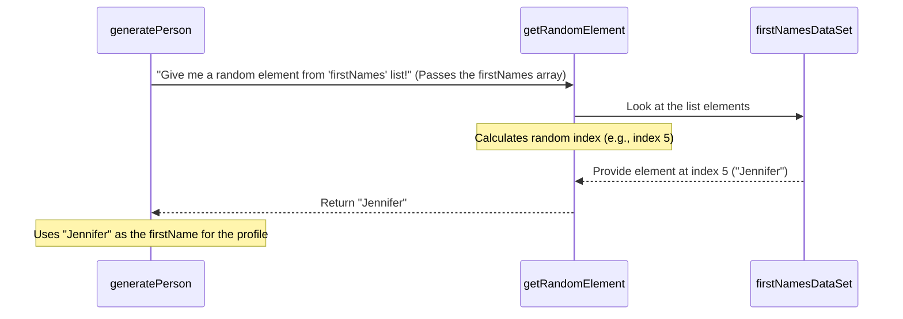

# Chapter 6: Data Sets

Welcome back! Over the past few chapters, we've explored how the Fake Identity Generator builds a **[Person Profile](01_person_profile_.md)** piece by piece. We've looked at **[Personal Details](02_personal_details_.md)**, **[Contact & Location](03_contact___location_.md)**, and **[Socioeconomic/Financial Data](04_socioeconomic_financial_data_.md)**. In [Chapter 5](05_generation_logic_.md), we pulled it all together by looking at the **Generation Logic**, understanding how the `generatePerson` function orchestrates the creation of a full profile.

We saw that the `generatePerson` function often picks random values for fields like names, cities, or occupations. But where does it pick these values *from*? That's where **Data Sets** come in.

### What are Data Sets?

At its simplest, a **Data Set** in this project is just a **list** or **collection** of possible values that the generator can use for a specific type of information.

Imagine you're baking a cake. You need ingredients like flour, sugar, and eggs. In our Fake Identity Generator, the "ingredients" for creating realistic-sounding data are lists of names, addresses, jobs, interests, and so on. These lists are our Data Sets.

The core use case they solve is: **Providing the source of realistic (but fake) options for the generator to randomly choose from.**

If you want to generate names, you need a list of names to pick from. If you want to generate cities, you need a list of cities. Data Sets are just these lists, pre-defined in the code.

### Where Do You Find Data Sets?

The Data Sets are defined right at the top of the `src/generateTestData.ts` file, just below the type definitions and constants. They are stored as **arrays** (lists in programming) in TypeScript.

Let's look at a small example from the code:

```typescript
// src/generateTestData.ts

// ... (Constants and Type definitions above) ...

// Data sets
const firstNames: string[] = [
  "James",
  "Mary",
  "John",
  "Patricia",
  "Robert",
  "Jennifer",
  "Michael",
  "Linda",
  // ... many more names ...
];

const lastNames: string[] = [
  "Smith",
  "Johnson",
  "Williams",
  "Brown",
  "Jones",
  "Garcia",
  "Miller",
  "Davis",
  // ... many more names ...
];

const cities: string[] = [
  "New York",
  "Los Angeles",
  "Chicago",
  "Houston",
  "Phoenix",
  // ... many more cities ...
];

const occupations: string[] = [
  "Teacher",
  "Engineer",
  "Doctor",
  "Nurse",
  "Lawyer",
  // ... many more occupations ...
];

// ... (Other data sets and helper functions below) ...
```

In this snippet, `firstNames`, `lastNames`, `cities`, and `occupations` are all examples of Data Sets. They are arrays of strings (`string[]`), meaning each list contains text values.

Each list provides a pool of potential values for a specific field in the **[Person Profile](01_person_profile_.md)**.

### How the Generator Uses Data Sets

As we saw in [Chapter 5](05_generation_logic_.md), the `generatePerson` function needs to get random values. It does this by using a simple helper function called `getRandomElement`.

The `getRandomElement` function takes one of these Data Set arrays as input and simply returns *one* random item from that list.

Here's a reminder of the `getRandomElement` function code:

```typescript
// src/generateTestData.ts

// ... (Data sets defined above) ...

// Helper functions
function getRandomElement<T>(array: T[]): T {
  // Math.random() gives a number between 0 and 1
  // array.length is the number of items in the list
  // Math.random() * array.length gives a number between 0 and the list length
  // Math.floor() rounds that number down to a whole number (an index)
  // array[...] uses that index to pick an item from the list
  return array[Math.floor(Math.random() * array.length)];
}

// ... (Other helper functions and generation logic below) ...
```

This small function is the key to using the Data Sets. It performs a simple calculation to pick a valid position (or "index") in the list and returns the item found at that position.

### The Process: Picking from a Data Set

Let's visualize how `generatePerson` uses `getRandomElement` and a Data Set (like `firstNames`) to get a first name:



The `generatePerson` function says "I need a random first name". It passes the entire `firstNames` list to `getRandomElement`. `getRandomElement` looks at the list, picks a random spot in it, grabs the name from that spot (e.g., "Jennifer"), and gives it back to `generatePerson`.

This exact process happens for every field that gets its value by picking from a predefined list (like `lastName`, `city`, `occupation`, `education`, `maritalStatus`, `interests`, `purchaseCategory`).

Looking back at the `generatePerson` code from [Chapter 5](05_generation_logic_.md), you can see `getRandomElement` being used with different Data Sets:

```typescript
// src/generateTestData.ts

// ... (Data sets firstNames, lastNames, occupations, etc. defined above) ...
// ... (Helper functions getRandomElement, generateAddress, etc. defined above) ...

function generatePerson(id: number): Person {
  // Picking from firstNames Data Set
  const firstName = getRandomElement(firstNames);

  // Picking from lastNames Data Set
  const lastName = getRandomElement(lastNames);

  // ... generating other details ...

  // Picking from occupations Data Set
  const occupation = getRandomElement(occupations);

  // ... generating other details ...

  // Picking from educationLevels Data Set
  const education = getRandomElement(educationLevels);

  // Picking from maritalStatuses Data Set
  const maritalStatus = getRandomElement(maritalStatuses);

  // generateInterests also picks from the 'interests' Data Set internally
  const interests = generateInterests();

  // generatePurchaseHistory also picks from the 'purchaseCategories' Data Set internally
  const purchaseHistory = generatePurchaseHistory();

  // ... assemble and return the Person object ...
}

// ... (rest of the file) ...
```

Each line like `getRandomElement(firstNames)` is where the generator reaches into a specific Data Set to pull out one random value for that field.

### Customizing the Data Sets

The great thing about Data Sets is how easy they make customization. Want your fake data to have names that sound German instead of primarily English? Or cities from Europe instead of the US?

You don't need to change the core generation logic (`generatePerson` or `getRandomElement`). You just need to edit the contents of the arrays themselves!

For example, to add some German first names:

```typescript
// src/generateTestData.ts

// ... (existing code) ...

const firstNames: string[] = [
  "James",
  "Mary",
  "John",
  "Patricia",
  "Robert",
  "Jennifer",
  // ... existing names ...
  "Heinrich", // <-- Add new names here!
  "Johanna",
  "Sebastian",
  "Sophie",
  "Maximilian",
  // ... more German names ...
];

// ... (rest of the file) ...
```

Just by changing the values *inside* the list, the generator will start picking from your new pool of options the next time you run it. This is the primary way to influence the variety and characteristics of the generated data.

### Conclusion

In this chapter, we learned about **Data Sets**. These are the predefined lists or collections (arrays) of possible values in the `src/generateTestData.ts` file that serve as the source material for many of the fields in a fake identity profile (like names, cities, jobs, etc.). We saw how the simple `getRandomElement` helper function is used by the **[Generation Logic](05_generation_logic_.md)** to pick a random value from a Data Set, and how easy it is to customize the generated data by simply editing the contents of these lists.

You now have a solid understanding of all the core concepts behind the Fake Identity Generator: the **[Person Profile](01_person_profile_.md)** structure, the different categories of data within it (**[Personal Details](02_personal_details_.md)**, **[Contact & Location](03_contact___location_.md)**, **[Socioeconomic/Financial Data](04_socioeconomic_financial_data_.md)**), the **[Generation Logic](05_generation_logic_.md)** that builds each profile, and the **Data Sets** that provide the pool of random values.

You're now equipped to understand how the project works end-to-end and how you can modify its core components to generate data tailored to your needs!

---
