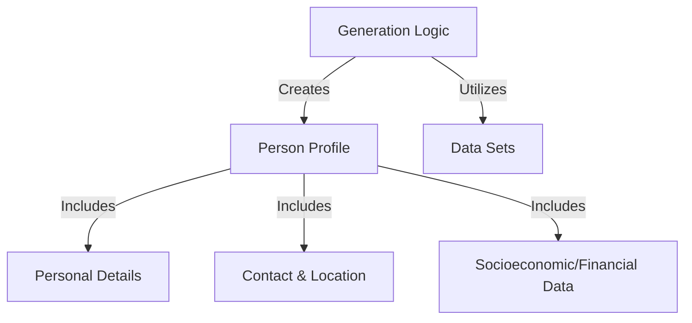

# Tutorial: Fake-Identity-Generator

This project is a **Fake Identity Generator**, a TypeScript tool designed to create large amounts of *synthetic data* in the form of detailed user profiles. It generates profiles containing various types of information like **personal details**, **contact information**, and **financial data**, useful for testing applications that require user data.

## Visual Overview

## Chapters

1. [Person Profile
](01_person_profile_.md)
2. [Personal Details
](02_personal_details_.md)
3. [Contact & Location
](03_contact___location_.md)
4. [Socioeconomic/Financial Data
](04_socioeconomic_financial_data_.md)
5. [Generation Logic
](05_generation_logic_.md)
6. [Data Sets
](06_data_sets_.md)

---